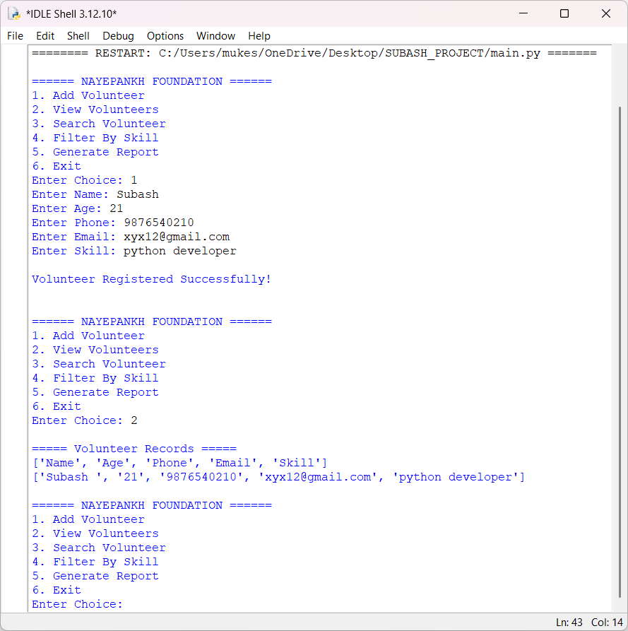

# NayePankh Foundation Volunteer Management System

## Overview

The NayePankh Foundation Volunteer Management System is a Python-based application developed to help NGOs efficiently manage volunteer information.

This project allows users to register volunteers, search volunteer records, filter volunteers based on skills, and generate simple reports. Volunteer data is stored in a CSV file, making it simple, lightweight, and beginner-friendly.

---

## Features

- Volunteer Registration
- View Volunteer Records
- Search Volunteers by Name
- Filter Volunteers by Skill
- Generate Volunteer Reports
- CSV-Based Data Storage
- Beginner-Friendly Python Project

---

## Technologies Used

- Python
- CSV File Handling
- File Management
- Menu-Driven Interface

---

## Project Structure

```text
nayepankh-volunteer-management/
│
├── main.py
├── volunteers.csv
├── requirements.txt
├── Output.png
└── README.md
```

---

## How to Run

### Step 1: Clone the Repository

```bash
git clone https://github.com/yourusername/nayepankh-volunteer-management.git
```

### Step 2: Navigate to the Project Folder

```bash
cd nayepankh-volunteer-management
```

### Step 3: Run the Application

```bash
python main.py
```

---

## Available Functions

### Add Volunteer

Stores volunteer details such as:

- Name
- Age
- Phone Number
- Email Address
- Skill

### View Volunteers

Displays all registered volunteer records.

### Search Volunteer

Search volunteers using their name.

### Filter By Skill

Find volunteers with specific skills such as:

- Teaching
- Fundraising
- Event Management
- Social Media

### Generate Report

Displays the total number of registered volunteers.

---

## Sample Output

```text
====== NAYEPANKH FOUNDATION ======

1. Add Volunteer
2. View Volunteers
3. Search Volunteer
4. Filter By Skill
5. Generate Report
6. Exit

Enter Choice: 1

Enter Name: Subash
Enter Age: 21
Enter Phone: 9876543210
Enter Email: subash@gmail.com
Enter Skill: Teaching

Volunteer Registered Successfully!
```

---

## Output Screenshot



---

## Applications

- NGO Volunteer Management
- Community Service Programs
- Event Coordination
- Social Welfare Organizations
- Educational NGOs

---

## Future Enhancements

- Graphical User Interface (GUI)
- SQLite Database Integration
- Volunteer Attendance Tracking
- Email Notifications
- PDF Report Generation
- Admin Login System

---

## Author

**SUBASH P**  
B.E Computer Science and Engineering (AI & ML)

---

## GitHub Topics

```text
python
ngo-management
volunteer-management
csv-storage
file-handling
python-project
beginner-project
social-impact
```

---

## Conclusion

This project demonstrates the use of Python, file handling, data storage, searching, filtering, and report generation in a real-world NGO management scenario. It is designed to be simple, practical, and suitable for beginners while providing meaningful functionality for volunteer management.

⭐ If you found this project useful, consider giving it a star on GitHub
